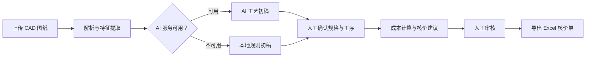
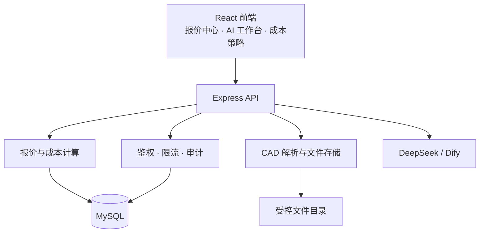

<div align="center">

# ⚙️ Machining Console

### 机加工 AI 智能报价系统

从 CAD 图纸解析、工艺初稿到核价单导出，让机加工报价更快、更清晰、可追溯。

[](https://nodejs.org/)
[](https://react.dev/)
[](https://www.mysql.com/)

[快速开始](#-快速开始) · [核心能力](#-核心能力) · [部署运维](#-部署与运维) · [项目结构](#-项目结构)

</div>

---

## ✨ 项目亮点

Machining Console 将本地可解释规则与 AI 能力结合：图纸先被解析为制造事实，AI 再据此提出工艺与核价建议；材料、工序和价格均由人工确认后写入报价记录。即使未配置 AI 服务，系统仍可使用本地规则持续完成报价流程。

<table>
  <tr>
    <td width="50%"><b>📐 多格式 CAD 解析</b><br>支持 DWG、DXF、STEP、STP 图纸的受控上传、实体解析与特征提取。</td>
    <td width="50%"><b>🤖 AI 工艺工作台</b><br>基于脱敏制造事实流式生成工艺初稿；失败时自动降级为本地规则。</td>
  </tr>
  <tr>
    <td><b>💰 可追溯成本核算</b><br>材料、工序、费率和策略均会保存为报价快照，不受后续配置修改影响。</td>
    <td><b>🛡️ 受控经营配置</b><br>JWT 登录、角色权限、请求限流、写操作审计与请求 ID 链路追踪。</td>
  </tr>
  <tr>
    <td><b>👀 人工核价闭环</b><br>支持规格确认、工序编辑、AI 建议、语义审核和人工审核。</td>
    <td><b>📤 交付即可用</b><br>审核通过后导出 Excel 核价单，并按保留策略清理关联原始文件。</td>
  </tr>
</table>

## 🧭 报价流程



> 报价由 **材料成本 + 机加工成本 + 损耗/附加成本 + 管销 + 利润 + 税费** 构成。计算所采用的材料、工序、费率和策略会随报价保存为快照，确保历史记录可追溯。

## 🚀 快速开始

### 环境要求

| 必需 | 版本 / 说明 |
| --- | --- |
| Node.js | 18 或更高版本 |
| MySQL | 8 或兼容版本 |
| DeepSeek API Key | 可选；未配置时 AI 能力自动降级 |

### 1. 安装依赖

```bash
cd backend
npm install

cd ../frontend
npm install
```

### 2. 创建并填写配置

```bash
cd backend
cp .env.example .env
```

至少填写 MySQL 连接、`AUTH_TOKEN_SECRET` 与初始管理员账号密码。请使用长度不少于 32 位的随机密钥，且不要提交 `.env`。

### 3. 初始化并启动

```bash
# 终端一：初始化数据库并启动 API（http://localhost:3001）
cd backend
npm run init-db
npm run dev
```

```bash
# 终端二：启动前端（http://localhost:3000）
cd frontend
npm start
```

打开 `http://localhost:3000`，使用初始化的管理员账号登录即可开始报价。

<details>
<summary><b>DWG 文件支持说明</b></summary>

DWG 通过内置的 `dwgdxf` WebAssembly 依赖在服务端转换并解析，无需安装 AutoCAD 或 ODA File Converter。当前支持 AutoCAD R13 至 R2018（`AC1012`–`AC1032`）格式。

</details>

## 🧩 系统组成



<details>
<summary><b>核心目录</b></summary>

```text
AI-QuoteSystem/
├── backend/
│   ├── src/
│   │   ├── middleware/       # 鉴权、限流、审计
│   │   ├── models/           # 报价领域模型
│   │   ├── routes/           # 认证、报价、上传、助手、目录 API
│   │   └── services/         # 计算、AI、CAD、存储、Excel 导出
│   ├── test/                 # 后端测试
│   └── .env.example          # 配置模板
├── frontend/src/
│   ├── api/                  # 集中式 API 调用
│   ├── auth/                 # 登录态管理
│   ├── components/           # 可复用组件
│   └── pages/                # 页面
├── docs/                     # 部署清单、Prompt 与知识库
└── README.md
```

</details>

## 🔧 常用命令

| 位置 | 命令 | 用途 |
| --- | --- | --- |
| `backend/` | `npm run dev` | 启动自动重载的 API 服务 |
| `backend/` | `npm run init-db` | 初始化数据库 |
| `backend/` | `npm run seed` | 写入或校正预置业务数据 |
| `backend/` | `npm test` | 运行后端测试 |
| `frontend/` | `npm start` | 启动开发服务器 |
| `frontend/` | `npm run build` | 构建生产前端资源 |
| `frontend/` | `npm test` | 运行前端测试 |

> [!WARNING]
> `npm run rebuild-db` 会重建数据库，可能导致数据丢失；仅在已完成备份且明确需要时使用。

## 🔐 配置与安全

完整配置见 [backend/.env.example](backend/.env.example)。常用配置包括：

| 类别 | 配置项 |
| --- | --- |
| 数据库 | `MYSQL_HOST`、`MYSQL_PORT`、`MYSQL_DATABASE`、`MYSQL_USER`、`MYSQL_PASSWORD` |
| 登录安全 | `AUTH_TOKEN_SECRET`、`AUTH_TOKEN_TTL_SECONDS`、`ADMIN_INITIAL_USERNAME`、`ADMIN_INITIAL_PASSWORD` |
| AI 服务 | `DEEPSEEK_API_KEY`、`DEEPSEEK_API_BASE`、`DEEPSEEK_MODEL`、`DIFY_API_BASE`、`DIFY_API_KEY` |
| AI 限制 | `AI_PROCESS_DRAFT_*`、`AI_QUOTE_MAX_TOKENS`、`AI_REVIEW_MAX_TOKENS` |
| 上传与保护 | `UPLOAD_DIR`、`UPLOAD_RETENTION_DAYS`、`API_RATE_LIMIT_PER_MINUTE` |

- API 默认要求登录；材料、工序、工站、形状和成本策略的写操作仅限管理员。
- 密码安全哈希保存；登出或改密后旧 Token 失效。
- 图纸使用随机标识命名，校验扩展名和文件头，接口不暴露服务器物理路径。
- `.env` 内的数据库密码、AI Key、JWT 密钥和初始密码均被 Git 忽略，不会上传到仓库。

## 📦 部署与运维

生产环境构建前端后，后端会在 `frontend/build` 存在时托管该静态资源。建议以 HTTPS 反向代理暴露应用：

| 探针 | 地址 | 含义 |
| --- | --- | --- |
| 存活检查 | `/health` | Node 服务可响应 |
| 就绪检查 | `/ready` | 服务可访问数据库 |

发布前请执行：

```bash
cd backend && npm test
cd ../frontend && npm run build
```

数据库备份、恢复演练、发布检查和日常巡检请遵循 [上线交付清单](docs/上线交付清单.md)。

---

<div align="center">

如需扩展功能或报告问题，请创建 Issue 或联系项目维护者。

<sub>未提供许可证文件；复用或发布前请先确认授权范围。</sub>

</div>
