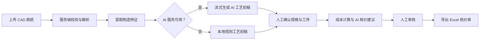
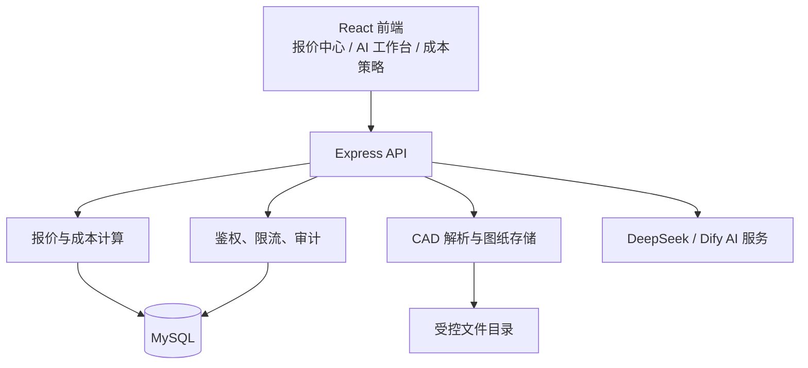

# Machining Console · 机加工 AI 智能报价系统

> 面向机加工报价场景的一体化工作台：从 CAD 图纸解析、制造特征识别和工艺初稿，到成本计算、人工核价与 Excel 核价单导出，形成可追溯的报价闭环。

[](https://nodejs.org/)
[](https://react.dev/)
[](https://www.mysql.com/)

## 目录

1. [项目概览](#项目概览)
2. [核心能力](#核心能力)
3. [报价流程](#报价流程)
4. [系统架构](#系统架构)
5. [快速开始](#快速开始)
6. [配置说明](#配置说明)
7. [常用命令](#常用命令)
8. [项目结构](#项目结构)
9. [安全与运维](#安全与运维)
10. [验证与贡献](#验证与贡献)

## 项目概览

Machining Console 将可解释的本地规则与 AI 能力结合：CAD 文件先在服务端解析为制造事实，再由 AI 提供工艺与核价建议；最终报价、工序和价格均由人工确认后入库。即使 AI 服务不可用，系统也能使用本地规则继续完成工艺初稿与报价流程。

适用的图纸格式：`DWG`、`DXF`、`STEP`、`STP`。

## 核心能力

| 模块 | 能力 |
| --- | --- |
| 图纸与模型 | 校验并安全存储 CAD 图纸；解析实体、边界与几何特征；支持 STEP 三维预览。 |
| AI 工艺工作台 | 基于脱敏后的制造事实生成流式工艺初稿，展示推理/结果过程；AI 失败或未配置时自动降级为本地规则。 |
| 报价引擎 | 依据材料、工序、机台费率、损耗、管销、利润和税率生成可追溯的成本快照。计算规则以 [计算公式总结](计算公式总结.md) 为准。 |
| 人工核价 | 支持工序增删改、材料与规格确认、AI 报价建议、语义审核和人工审核。 |
| 经营配置 | 管理材料、材料价格、工序、工站、形状和成本策略；配置接口仅管理员可访问。 |
| 交付导出 | 通过审核后导出 Excel 核价单；完成的报价会保留结构化记录，并清理关联的原始图纸与三维缓存。 |
| 安全与审计 | JWT 登录、密码哈希、管理员角色控制、请求限流、写操作审计日志与请求 ID 链路追踪。 |

## 报价流程



### 成本构成

```text
材料成本 + 机加工成本 + 损耗/附加成本 + 管销 + 利润 + 税费
```

系统将报价时使用的材料、工序、费率和策略保存为快照，避免之后调整配置影响历史报价。详细公式、字段定义和示例请查看 [计算公式总结](计算公式总结.md)。

## 系统架构



## 快速开始

### 环境要求

- Node.js 18 或更高版本
- MySQL 8 或兼容的 MySQL 服务
- 可选：DeepSeek API Key（未配置时 AI 功能会优雅降级）

### 1. 安装依赖

```bash
cd backend
npm install

cd ../frontend
npm install
```

### 2. 配置后端环境变量

```bash
cd backend
cp .env.example .env
```

编辑 `backend/.env`，至少配置 MySQL 连接、`AUTH_TOKEN_SECRET` 和初始管理员账号密码。生产环境请使用随机且不少于 32 位的密钥，切勿提交 `.env` 文件。

### 3. 初始化数据库

```bash
cd backend
npm run init-db
```

首次启动也会确保数据库结构可用，并在尚无管理员时按环境变量创建初始管理员。

### 4. 启动开发环境

在两个终端分别执行：

```bash
# 终端一：API 服务（http://localhost:3001）
cd backend
npm run dev
```

```bash
# 终端二：前端开发服务器（http://localhost:3000）
cd frontend
npm start
```

浏览器打开 `http://localhost:3000`，使用初始化的管理员账号登录。

## 配置说明

所有配置项见 [backend/.env.example](backend/.env.example)。以下为常用项：

| 配置项 | 用途 |
| --- | --- |
| `MYSQL_HOST`、`MYSQL_PORT`、`MYSQL_DATABASE` | MySQL 连接配置。 |
| `AUTH_TOKEN_SECRET`、`AUTH_TOKEN_TTL_SECONDS` | JWT 签发密钥与有效期。 |
| `ADMIN_INITIAL_USERNAME`、`ADMIN_INITIAL_PASSWORD` | 仅在系统尚无管理员时创建初始账号；首次登录改密后应移除初始密码。 |
| `DEEPSEEK_API_KEY`、`DEEPSEEK_API_BASE`、`DEEPSEEK_MODEL` | AI 工艺与核价能力的模型配置。 |
| `AI_PROCESS_DRAFT_*` | AI 工艺初稿的开关、超时、思考增量与输出上限。 |
| `AI_QUOTE_MAX_TOKENS`、`AI_REVIEW_MAX_TOKENS` | AI 报价建议和审核的输出上限。 |
| `DIFY_API_BASE`、`DIFY_API_KEY` | 可选的 Dify 聊天助手配置，仅服务端使用。 |
| `UPLOAD_DIR`、`UPLOAD_RETENTION_DAYS` | 上传文件目录与未关联图纸保留天数。 |
| `API_RATE_LIMIT_PER_MINUTE` | 每分钟 API 请求上限，默认 240。 |

### DWG 解析

DWG 会通过内置的 `dwgdxf` WebAssembly 依赖在服务端转换并解析，不需要安装 AutoCAD 或 ODA File Converter。当前支持 AutoCAD R13 至 R2018（`AC1012`–`AC1032`）格式。

## 常用命令

在对应目录执行：

| 目录 | 命令 | 说明 |
| --- | --- | --- |
| `backend/` | `npm run dev` | 启动带自动重载的 API 服务。 |
| `backend/` | `npm run init-db` | 初始化数据库。 |
| `backend/` | `npm run seed` | 写入或校正预置业务数据。 |
| `backend/` | `npm test` | 执行后端 Node.js 测试。 |
| `frontend/` | `npm start` | 启动 React 开发服务器。 |
| `frontend/` | `npm run build` | 构建生产前端资源。 |
| `frontend/` | `npm test` | 执行前端测试。 |

> `npm run rebuild-db` 会重建数据库，可能导致数据丢失，仅在明确需要时使用。

## 项目结构

```text
AI-QuoteSystem/
├── backend/
│   ├── src/
│   │   ├── middleware/       # 鉴权、限流、审计等横切能力
│   │   ├── models/           # 报价领域模型
│   │   ├── routes/           # 认证、报价、上传、助手与目录 API
│   │   ├── services/         # 计算、AI、CAD、图纸存储、Excel 导出
│   │   ├── app.js            # Express 应用与路由装配
│   │   └── server.js         # 服务启动与优雅关闭
│   ├── test/                 # 后端单元测试
│   └── .env.example          # 环境变量模板
├── frontend/
│   └── src/
│       ├── api/              # 集中式 API 调用
│       ├── auth/             # 登录态管理
│       ├── components/       # 可复用界面组件
│       └── pages/            # 报价、AI 工作台、策略等页面
├── docs/                     # 部署清单、AI Prompt 与业务知识库
├── 计算公式总结.md            # 报价公式的事实来源
└── README.md
```

## 安全与运维

- API 默认要求登录；材料、工序、工站、形状和成本策略的写操作仅限管理员。
- 密码采用安全哈希保存；登出或改密后，旧 Token 失效。
- CAD 文件使用随机标识命名，校验扩展名与文件头，接口不会暴露服务器物理路径。
- 原始图纸与三维缓存会按保留策略清理；已完成报价立即清理关联文件，同时保留必要的结构化报价记录。
- 生产部署应通过 HTTPS 反向代理暴露服务，使用 `/health` 进行存活探测、`/ready` 验证数据库就绪状态。
- 发布、备份、恢复演练和巡检要求请遵循 [上线交付清单](docs/上线交付清单.md)。

## 验证与贡献

提交改动前，建议执行：

```bash
cd backend && npm test
cd ../frontend && npm run build
```

对涉及数据库和 API 的改动，还应手动验证登录、图纸上传、解析、AI 降级、报价计算、审核、导出，以及 `/health` 与 `/ready`。提交信息使用简洁的 scoped 格式，例如 `feat: ...` 或 `fix(ui): ...`。

## 许可证

当前仓库未提供许可证文件；在复用或发布前，请先与项目维护者确认授权范围。
